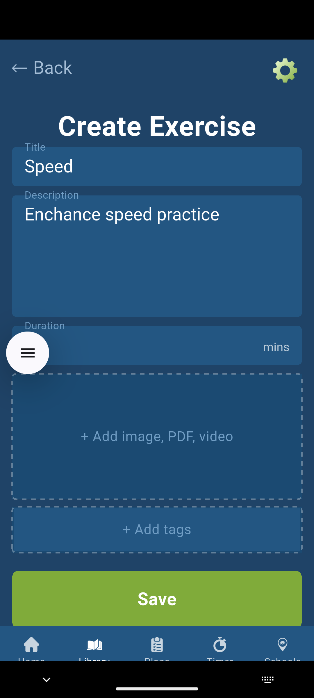
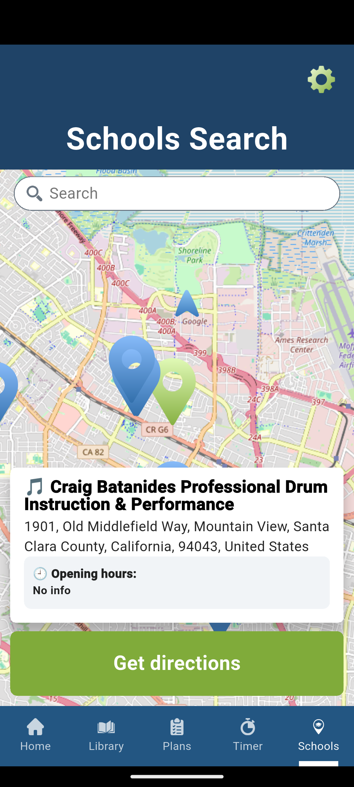
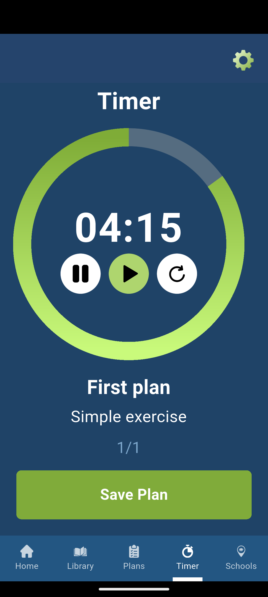

# Drum Master Practice 🥁

An advanced, all-in-one practice ecosystem for drummers. Developed as a high-retention utility for a **Gambling Affiliate Program**, this app combines complex functional tools with seamless user engagement strategies.
---

## 📖 Overview
**Drum Master Practice** is designed to be the ultimate companion for musicians. It moves beyond simple metronomes by offering a full suite of management tools: from a complete CRUD system for exercises to geolocation features for finding local music infrastructure.

## ✨ Key Features
* **Exercise Management (Full CRUD):** Create, customize, and manage your own library of rudiments and drum techniques.
* **Structured Training Plans:** Group exercises into daily routines and long-term practice schedules.
* **Smart Training Timer:** A specialized timer module for tracking focused practice sessions.
* **Music School Finder:** Integrated Map API to locate nearby drumming studios and music schools.
* **Progress Insights:** Visualize your practice consistency and speed (BPM) growth over time.

## 🚀 Status
- **Google Play Store:** ✅ Verified & Published
- **Current Version:** 1.0.0
- **Build:** Flutter Stable Channel

## 📸 Screenshots

  
  
  
  

